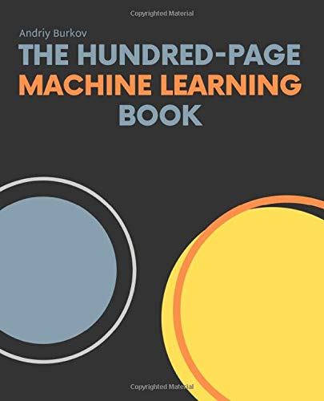

# the hundred-page machine learning book 🦊

<div align="center">
    
</div>


[公式サイト](http://themlbook.com/)

[公式Wiki](http://themlbook.com/wiki/doku.php?id=start&do=index)

["read first, buy later"](http://themlbook.com/wiki/doku.php)であり、ドラフト版を見ることができる。

# about

- Please edit freely.
  - チームは自由に編集できるようになっている･･･はず･･･（権限ミスあるかもです）

<div align="center">
    
</div>


# clone 🦊

```bash
git clone https://github.com/tsukuba-mas/The_Hundred_ML.git
cd The_Hundred_ML
```

# Environment 🦊


```bash

# jupyter/datascience-notebookイメージをダウンロード
docker pull jupyter/datascience-notebook

# Dockerfileの作成
cat > Dockerfile <<EOF
FROM jupyter/datascience-notebook

RUN pip install --upgrade pip
RUN pip install jupyterlab RISE
RUN jupyter serverextension enable --py jupyterlab
RUN jupyter-nbextension install rise --py --sys-prefix
RUN jupyter-nbextension enable rise --py --sys-prefix
EOF

# jupyterlab:latestというイメージをビルド
docker build -t jupyterlab:latest ./
　
# パスワードの設定
docker run --rm -it \
  jupyter/datascience-notebook /bin/bash -c \
  "python -c 'from notebook.auth import passwd;print(passwd())'"

# Enter password:
# Verify password:
# sha1:xxxxx~~~xxxx


# Jupyter Lab
# --rm コンテナ終了時に削除
# p　my_port:container_port
# --name コンテナ名
# -v  ホストパス:コンテナパス
# jupyterlab:latestu  イメージ
# start.sh jupyter lab --NotebookApp.password="sha1:xxxxxxxxxxxxxxxxxxxxxxxx" コンテナに実行させるコマンド
docker run --rm -e TZ=Asia/Tokyo -p 8888:8888 --name jupyterlab -v `pwd`/work:/home/jovyan/work jupyterlab:latest start.sh jupyter lab --NotebookApp.password="xxxxxxxx"

# Jupyter Notebook
docker run --rm -e TZ=Asia/Tokyo -p 8888:8888 --name jupyterlab -v (pwd)/work:/home/jovyan/work jupyterlab:latest start.sh jupyter notebook --NotebookApp.password="xxxxxxxx"

# open http://localhost:8888

# NotebookApp.passwordを忘れたとき
python -c 'from notebook.auth import passwd;print(passwd())'

```

# Google Colaboratory 🦊


```
https://colab.research.google.com/github/tsukuba-mas/The_Hundred_ML/blob/master/ipynbのへのリンク
```

example

https://colab.research.google.com/github/tsukuba-mas/The_Hundred_ML/blob/master/work/chapter1/SVM.ipynb


# Division (tentative) 🦊

### Chapter1 Introduction [(PDF)](http://bit.ly/theMLbook-Chapter-1)

- [x] [1.1-1.4]

### Chapter2 Notation and Definitions [(PDF)](http://bit.ly/theMLbook-Chapter-2)

- [x] [2.1-2.8]

### Chapter3 Fundamental Algorithmes [(PDF)](http://bit.ly/theMLbook-Chapter-3)

- [x] [3.1-3.2]
- [x] [3.3-3.5] [pdf](https://speakerdeck.com/ganariya/lun-jiang-the-hundred-ml-3-dot-3-3-dot-5)

### Chapter4 Anatomy of a Learning Algorithm [(PDF)](http://bit.ly/theMLbook-Chapter-4)

- [x] [4.1-4.2] [PDF（manaba）](https://manaba.tsukuba.ac.jp/ct/page_1097346c1097298)
- [x] [4.3-4.4]

### Chapter5 Basic Practice [(PDF)](http://bit.ly/theMLbook-Chapter-5)

- [x] [5.1] [pdf(4.3-5.1)](https://drive.google.com/file/d/1nJzzIAPkKan3ektHn0YCM8BsiXDPx7uO/view?usp=sharing)
- [ ] [5.2-5.5]
- [ ] [5.6-5.7]

### Chapter6 Deep Learning [(PDF)](http://bit.ly/theMLbook-Chapter-6)

- [ ] [6.1-6.2.1]
- [ ] [6.2.2]

### Chapter7 Problems and Solutions [(PDF)](http://bit.ly/theMLbook-Chapter-7)

- [ ] [7.1-7.3]
- [ ] [7.4-7.5]
- [ ] [7.6-7.8]
- [ ] [7.9-7.11]

### Chapter8 Advanced Practice [(PDF)](http://bit.ly/theMLbook-Chapter-8)

- [ ] [8.1-8.4]
- [ ] [8.5-8.8]

### Chapter9 Unsupervised Learning [(PDF)](http://bit.ly/theMLbook-Chapter09)

- [ ] [9.1-9.2.1]
- [ ] [9.2.2-9.2.4]
- [ ] [9.3-9.4]

### Chapter10 Other Forms of Learning [(PDF)](http://bit.ly/theMLbook-Chapter-10)

- [ ] [10.1-10.2]
- [ ] [10.3-10.4]

### Chapter11 Conclusion [(PDF)](http://bit.ly/theMLbook-Chapter-11)

- [ ] [11]
